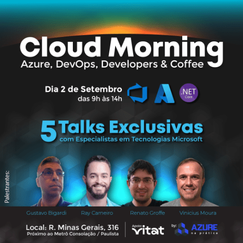
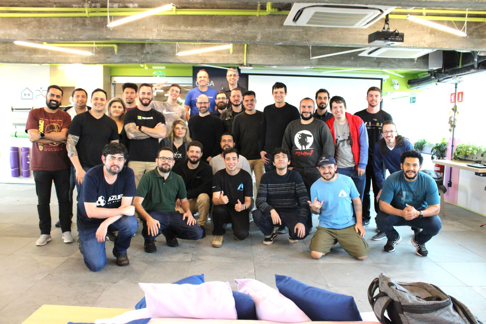
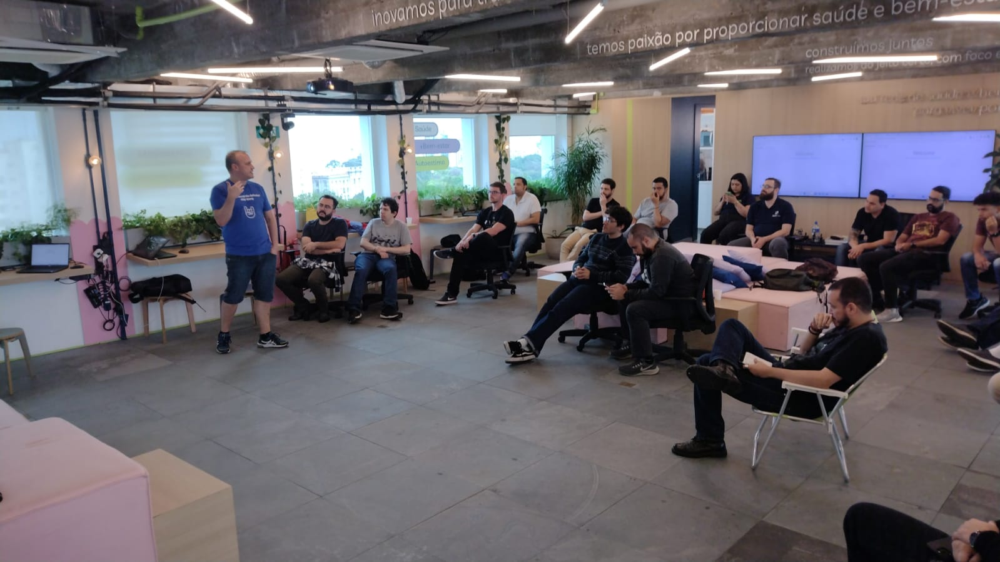
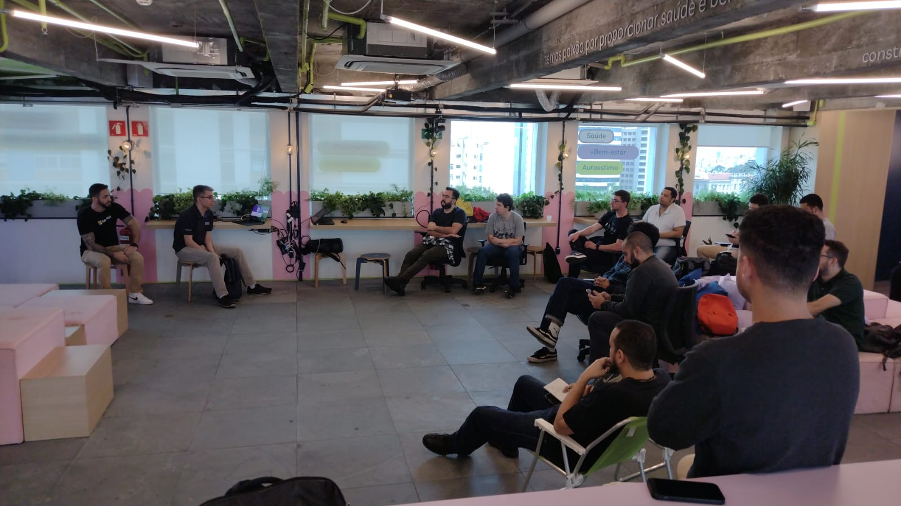

# Cloud Morning 2023 - Azure na Prática - São Paulo - SP
Fotos e informações gerais sobre o evento **Cloud Morning**, realizado pela comunidade **Azure na Prática** em **02/09/2023** na cidade de **São Paulo-SP**.

Organizadores:
- **Milton Camara Gomes (Microsoft MVP, MTAC)**
- **Vinicius Moura (Microsoft MVP, MTAC)**
- **Renato Groffe (Microsoft MVP, MTAC)**

Número de participantes: **28 pessoas**

Apresentações/talks que aconteceram durante o evento:
* **Processos de Governança de Infraestrutura com IaC e Azure Devops - Gustavo Bellini Bigardi (Microsoft MVP) / Ray Carneiro (Microsoft)**

* **Dicas para Atingir DevOps Self Service - Vinicius Moura (Microsoft MVP)**

* **MFA e Azure AD B2C: Implementando autenticação multifator em poucos cliques! - Renato Groffe (Microsoft MVP, MTAC)**

Tecnologias abordadas: **Azure DevOps, Microsoft Azure, Terraform, Azure Boards, Azure Pipelines, Azure AD B2C, .NET**

Acesse este [**link**](/img/) para visualizar todas as fotos das apresentações.

Formulário utilizado para inscrições: [**Eduzz**](https://evento.blinket.com.br/anp-cloud-morning)

Local: Vitat - Rua Minas Gerais, 316 - Higienópolis - São Paulo/SP - CEP: 05276-525

---

